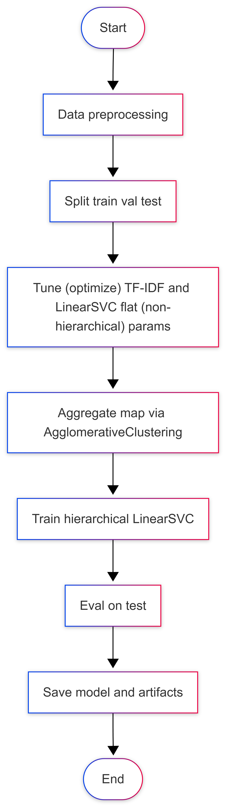
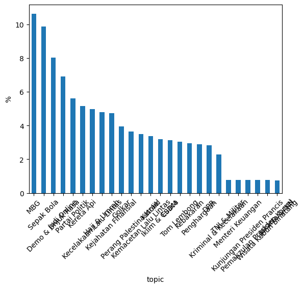
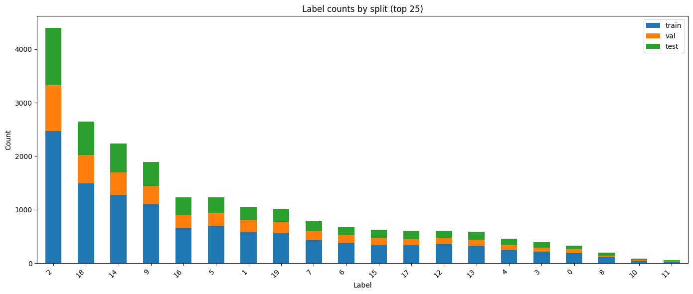

# 3-Stage (AgglomerativeClustering + 2-Stage Hierarchical LinearSVC) News Topic Classifier

This projects trains a hierarchical text classifier for Indonesian articles using TF-IDF features + LinearSVC, with a data-driven "aggregate topic" stage built via AgglomerativeClustering. Validated on two case studies: 
- an unlabeled Indonesian news corpus (Kaggle 2025) that I labeled efficiently via a cluster-first workflow (SentenceTransformers + BERTopic, then selective manual labeling)
- a finance-topic dataset consisting of short, headline-like sentences (avg. ~118 characters), to test robustness across different text lengths and class imbalance.

## How to Run
1. Prerequisites
   - Python 3.10+
   - ``pip`` available
   - (Optional) GPU for `data_prep_clustering.ipynb` (CPU is fine, just slower). You can change the embedding settings to CPU.
   - `pyproject.toml` is provided

2. Create a virtual environment:
   ```sh
   python -m venv venv
   ```

3. Activate the virtual environment:
   - Windows:
     ```sh
     .\venv\Scripts\activate
     ```
   - Unix/MacOS:
     ```sh
     source venv/bin/activate
     ```

3. Install dependencies as specified in `pyproject.toml`
    ```bash
    pip install -e .
    ```

## Model Development
### Background
This model uses a two-stage (hierarchical) classifier because the label space is fairly granular and uneven, and a single flat classifier often ends up doing a hard job where it has to distinguish between very similar subtopics. Splitting that into stages (aggregate -> granular/specific) usually makes the decision boundary cleaner and more stable.

However, I didn't want to hardcode a manual topic taxonomy, because manual taxonomies often bake in our assumptions about what "belongs together", but those assumptions don't always match how the articles are actually written. Two topics can feel related in our heads yet use very different vocabulary, while other topics we'd separate might share a lot of recurring phrases. So instead of forcing rules like "K-Pop must belong under Hiburan", the model builds "aggregate topics" automatically from the data. If K-Pop articles are textually closest to Hiburan-like labels, they’ll naturally end up grouped together for Stage 1 without even a single manual mapping.

### Implementation


#### 1. Data Preprocessing
Both datasets exhibit pronounced class imbalance, including multiple rare labels with limited support. For the first dataset, a mix of dominant and rare topics is deliberately sampled to simulate class imbalance, while the second dataset is naturally imbalanced.




Before getting to the actual model building, first:

- Drop missing/too-short content
- Normalize whitespace, remove URLs
- Fix missing spaces (camelCase / punctuation spacing)
- Clean and normalize text using the `TextCleaner` pipeline available in this project (`IndonesianNewsCleaner` for the first dataset, `IndonesianNewsCleaner` + `FinanceCleaner` for the second dataset)
- For the first dataset, combine the title + content + tags using `TextCombiner` (available in this project as well) to create a new column `text` to use as the target column

Tokenization and stopword removal aren't used because Indonesian words often change form with prefixes/suffixes (like me-, ber-, -kan, -nya). If we add stemming or complicated token rules, it's easy to "clean" words in the wrong way or in inconsistent ways across articles, which can remove useful information and make the model's behavior less stable.

Stopword removal is also skipped because in Indonesian articles, what may constitute "common words" are not always useless. Some function words and short connectors still appear in topic-specific phrases and named entity contexts, and stopword lists for Indonesian vary a lot in coverage and quality. Removing them blindly can drop informative n-grams and hurt minority classes.

So instead, the model relies on TF-IDF word n-grams plus character n-grams. Word n-grams capture common phrases, while character n-grams help with affixes, spelling variants, and noisy formatting, all without requiring a language-specific tokenizer or stemmer.

#### 2. Split
Dataset 1 is split into train/val/test at ~80/10/10 (stratified where possible). Dataset 2 is used with its original pre-defined split.

#### 3. Tune featurizer (TF-IDF) + LinearSVC baseline hyperparameters
I use Optuna to tune the TF-IDF + LinearSVC hyperparameters because it's a fast and practical way to search a mixed hyperparameter space (integer ranges like `min_df`, continuous ranges like `max_df`, plus log-scaled `C`). Compared to brute-force grid search, Optuna's Bayesian/TPE-style sampling tends to reach good configurations with far fewer trials, so you get better results per minute.

Optuna also supports pruners (I use a MedianPruner) to stop obviously underperforming trials early. That matters here because each trial requires fitting vectorizers and training an SVM, so pruning avoids spending full compute on "clearly not it" parameter sets.

The "trade-off" (if it counts as one) is that Optuna is stochastic. Even with the same dataset and random seed, the exact best parameters can vary slightly between runs because the sampler explores different parts of the search space. In practice the variance should be small if you keep the search space reasonable and run enough trials, but you shouldn't expect identical best params every time.

The objective function used to optimize the hyperparameters is maximizing the macro F1 score.

#### 4. Automatically build aggregrate buckets
On training data only:
- Compute TF-IDF centroid for each granular label
- Cluster those label centroids via AgglomerativeClustering using cosine distance. 
- Each cluster becomes an aggregate label (`C0`, `C1`, etc.)
- Very rare labels become their own cluster to avoid noisy grouping

AgglomerativeClustering is used because it can directly use a cosine distance matrix, while most other clustering methods (e.g., KMeans) are Euclidean-based. The idea is that in TF-IDF space, similar articles (writing patterns) have high cosine similarity (i.e., point in similar directions). Cosine distance is used because AgglomerativeClustering works by merging items based on minimum distance (i.e., it expects "smaller = closer" matrix instead of a "bigger = more similar" matrix).

#### 5. Train hierarchical classifiers
- Stage 1: LinearSVC predicts aggregate cluster `Ck`
- Stage 2: For each `Ck`, train another LinearSVC to predict the granular topic inside that cluster. If a bucket is too small or only has one granular label, use a fallback (majority / single label) to avoid producing a shaky model.

LinearSVC is a great fit here because this is high-dimensional, sparse text classification (TF-IDF produces huge vectors with mostly zeros), which is why it's a strong baseline for news/topic classification. It also handles class imbalance reasonably well via `class_weight="balanced"`. Finally, it's relatively fast and memory-friendly, especially compared to deep learning models.

Because LinearSVC already handles sparse vector + high dimensionality well, dimensionality reduction like SVD isn't used to keep the model simple (less hyperparameters to tune). Since the classes are imbalanced as well (with many minority classes having small support), SVD can hurt the model performance instead because SVD can wash out rare but discriminative signals, which might reduce macro F1.

#### 6. Evaluate on test
##### 6.1 First Dataset
| Label                      |  Precision |     Recall |   F1-score |    Support |
| -------------------------- | ---------: | ---------: | ---------: | ---------: |
| DPR                        |     1.0000 |     0.9500 |     0.9744 |         20 |
| Demo & Unjuk Rasa          |     0.9333 |     0.9655 |     0.9492 |         58 |
| ESDM                       |     0.9600 |     1.0000 |     0.9796 |         24 |
| Golkar                     |     1.0000 |     0.9600 |     0.9796 |         25 |
| Haji & Umrah               |     0.9706 |     1.0000 |     0.9851 |         33 |
| Iklim & Cuaca              |     1.0000 |     0.9600 |     0.9796 |         25 |
| Jakarta & IKN              |     1.0000 |     0.7500 |     0.8571 |          4 |
| Judi Online                |     1.0000 |     0.9574 |     0.9783 |         47 |
| Katolik                    |     1.0000 |     0.9600 |     0.9796 |         25 |
| Kebakaran                  |     0.9474 |     0.9474 |     0.9474 |         19 |
| Kecelakaan Lalu Lintas     |     1.0000 |     0.9310 |     0.9643 |         29 |
| Kejahatan Finansial        |     0.9091 |     0.9677 |     0.9375 |         31 |
| Kemacetan Lalu Lintas      |     0.9167 |     1.0000 |     0.9565 |         22 |
| Kereta Api                 |     0.9722 |     0.9722 |     0.9722 |         36 |
| Kriminal & Kecelakaan      |     1.0000 |     0.9333 |     0.9655 |         15 |
| Kunjungan Presiden Prancis |     1.0000 |     1.0000 |     1.0000 |          4 |
| MBG                        |     1.0000 |     0.9744 |     0.9870 |         78 |
| Menteri Keuangan           |     1.0000 |     1.0000 |     1.0000 |          6 |
| Partai Politik             |     1.0000 |     0.9750 |     0.9873 |         40 |
| Pemakzulan Presiden Korsel |     1.0000 |     1.0000 |     1.0000 |          4 |
| Penghargaan                |     0.7391 |     1.0000 |     0.8500 |         17 |
| Perang Palestina-Israel    |     0.9600 |     1.0000 |     0.9796 |         24 |
| Sepak Bola                 |     1.0000 |     0.9872 |     0.9935 |         78 |
| TNI & Militer              |     1.0000 |     1.0000 |     1.0000 |          6 |
| Tom Lembong                |     1.0000 |     0.9545 |     0.9767 |         22 |
| Wisata Kebun Binatang      |     1.0000 |     1.0000 |     1.0000 |          5 |
| **accuracy**               | **0.9713** | **0.9713** | **0.9713** | **0.9713** |
| **macro avg**              | **0.9734** | **0.9671** | **0.9685** |    **697** |
| **weighted avg**           | **0.9744** | **0.9713** | **0.9719** |    **697** |

Accuracy **0.971**, weighted F1 **0.972**, macro F1 **0.968 (n=697)**. Most classes achieve near perfect precision/recall. The most notable errors occur in:
- very low-support labels (e.g., _Jakarta & IKN_, n=4)
- semantically broad labels (e.g., _Penghargaan_), and because these articles often describe government institutions receiving awards, their vocabulary overlaps with other government-heavy topics like _Partai Politik_, _MBG_, _Judi Online_, and _Kejahatan Finansial_.

##### 6.2 Second Dataset

| Label            | Precision |   Recall | F1-score |  Support |
| ---------------- | --------: | -------: | -------: | -------: |
| 0                |      0.74 |     0.63 |     0.68 |       63 |
| 1                |      0.81 |     0.80 |     0.80 |      168 |
| 2                |      0.84 |     0.86 |     0.85 |      938 |
| 3                |      0.72 |     0.59 |     0.65 |       71 |
| 4                |      0.93 |     0.97 |     0.95 |      115 |
| 5                |      0.94 |     0.93 |     0.94 |      285 |
| 6                |      0.73 |     0.80 |     0.76 |       99 |
| 7                |      0.92 |     0.89 |     0.90 |      171 |
| 8                |      0.82 |     0.63 |     0.71 |       43 |
| 9                |      0.64 |     0.65 |     0.65 |      275 |
| 10               |      0.75 |     0.75 |     0.75 |       16 |
| 11               |      0.90 |     0.90 |     0.90 |       10 |
| 12               |      0.80 |     0.77 |     0.79 |      102 |
| 13               |      0.83 |     0.74 |     0.78 |      140 |
| 14               |      0.75 |     0.77 |     0.76 |      337 |
| 15               |      0.80 |     0.73 |     0.76 |      138 |
| 16               |      0.91 |     0.89 |     0.90 |      260 |
| 17               |      0.94 |     0.85 |     0.89 |      140 |
| 18               |      0.83 |     0.90 |     0.87 |      582 |
| 19               |      0.83 |     0.82 |     0.83 |      240 |
| **accuracy**     |           |          | **0.83** | **4193** |
| **macro avg**    |  **0.82** | **0.79** | **0.81** | **4193** |
| **weighted avg** |  **0.83** | **0.83** | **0.83** | **4193** |

Accuracy **0.83**, weighted F1 **0.83**, macro **F1 0.81 (n=4193)**. Several classes achieve strong precision/recall (many around 0.89–0.95 F1), but the most notable errors occur in:
- labels with lower supports (e.g., label 10, n=16; label 11, n=10; label 8, n=43), where performance is more sensitive to small sample sizes
- labels that are probably harder to separate (e.g., labels 0/3/9, ~0.65-0.68 F1), which likely reflect overlapping semantics in short headline-like text

Because these finance topics are encoded as numeric labels, it's difficult to interpret specific failure modes meaningfully without inspecting the underlying content and confusion pairs for each label.

Lower scores on the finance dataset are unsurprising because short inputs are more sparse in information, and overlapping topics share similar vocabulary, which increases ambiguity for a lexical model like TF-IDF + LinearSVC.

## Recommendations

1. Instead of tuning on just a flat (non-hierarchical) model on validation macro F1 and reusing the params for the hierarchical model, I would use Optuna to tune the full hierarchical pipeline end-to-end, because the best TF-IDF and `C` values for flat classification aren't guaranteed to be best in the hierarchical as well, where it involves clustering and two-stage routing as well. On top of that, the errors during the first stage of the LinearSVC fitting (for the aggregate one, which is predicting based on the clusters produced by AgglomerativeClustering) can mislead the final granular outcome. To prevent this from exploding the compute time (since hierarchical trials are heavier), keep pruning (perhaps even prune harder). When optimizing for the hierarchical model, some more hyperparameters can be tuned:
    - `N_aggregate_CLUSTERS` (stage 1/aggregate model)
    - `MIN_LABEL_SUPPORT_FOR_CLUSTER` (stage 1/aggregate model)
    - `MIN_BUCKET_SIZE` (stage 2/granular model)

    Tuning the clusters is especially relevant given the ambiguity of some topics, so different cluster settings might separate ambiguous topic families more cleanly.

2. Increase Optuna trials to search the hyperparameters space better. With increased trials, there will be more coverage of the search space, because Optuna is less prone to getting stuck in local optimum than classic hyperparameter optimizers like SGD as it explores the space by trying many separate configurations and doesn't move by taking small gradient steps from a single starting point (so it's less tied to any single local neighborhood).

3. Some labels are semantically broad and prone to becoming a catch-all. Some practical options are to consider multi-label (allow articles to be different topics at the same time) or re-scope the label.

4. Add hard negatives for magnet labels, e.g., for each _Penghargaan_ example, include additional training samples that contain award-related wording but are labeled as _MBG_ / _Partai Politik_ / _Kejahatan Finansial_ / etc. This helps the classifier learn that award vocabulary alone is not decisive.

5. For short text settings like the second dataset, adding minimal context (e.g., subheadline/lead sentence) is likely to improve separability.

6. For short text settings as well, consider swapping the TF-IDF feature extractor for SentenceTransformer embeddings while keeping the same hierarchical pipeline (including agglomerative clustering), since embedding spaces tend to separate short ambiguous texts more reliably.